# The Internship Lead Team
**[Home](../phase-0/week-1/README.md)** 

---

# The Internship Lead Team

The internship program exists thanks to a team of dedicated volunteers from ITS & our campus partners.

---

## Claire Tucker
* **Title:** Community Programs Outreach Coordinator
* **Department:** ITS
* **Key Responsibilities:**
    * Oversees planning, programming, logistics, and execution.
    * Serves as the main point of contact for questions/concerns.
    * Triage for issues—if she can't answer, she finds someone who can.

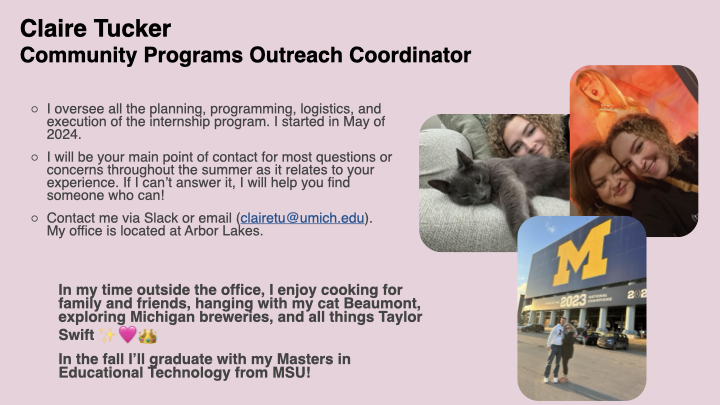

---

## DePriest Dockins
* **Title:** Director, Identity & Access Management
* **Department:** ITS Identity & Access Management (IAM)
* **Key Responsibilities:**
    * Leads the IAM team (managing uniqnames, passwords, Duo).
    * **Program Founder:** One of the original founders of the ITS Internship program.

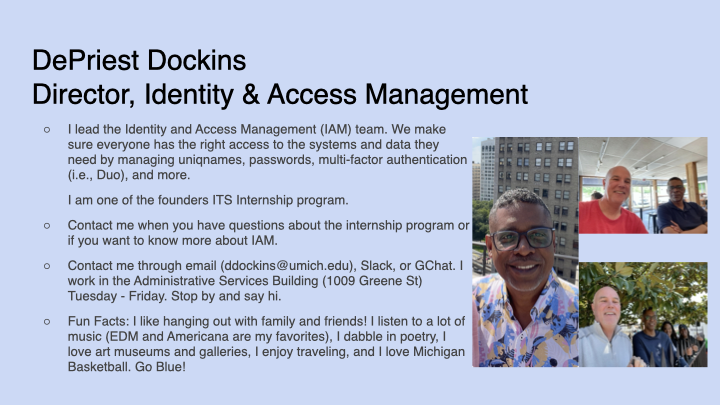

---

## James Markus
* **Title:** HR Financial Specialist
* **Department:** ITS Finance & HR
* **Key Responsibilities:**
    * Manages position control systems and tuition support.
    * **Contact For:** Hiring process, payroll, remote work policies, and resume/CV building.

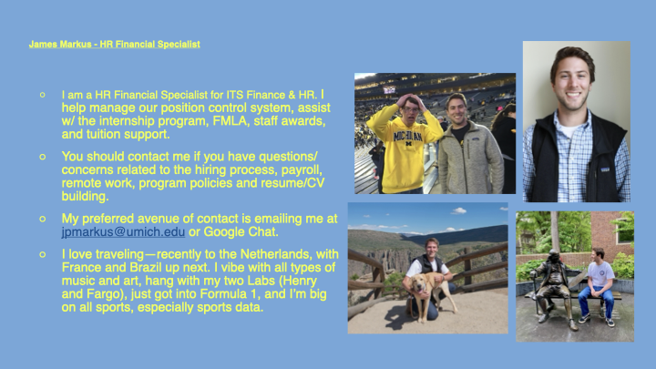

---

## Jeff Castle
* **Title:** Senior IT Project Manager
* **Department:** ITS Project Management Office (PMO)
* **Key Responsibilities:**
    * Manages various projects (network and telecom focus).
    * Collaborates with the ITS Infrastructure lead team for strategy and forecasting.

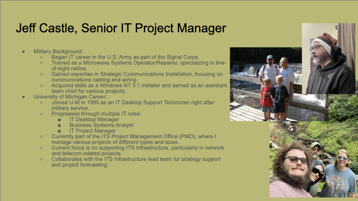

---

## Kranthi Bandaru
* **Title:** Data Integration and API Manager
* **Department:** ITS (Data Warehouse / API Directory)
* **Key Responsibilities:**
    * Manages the Data Warehouse and API Directory.
    * **Committee Role:** Member of the Professional Development Subcommittee (includes field trips).

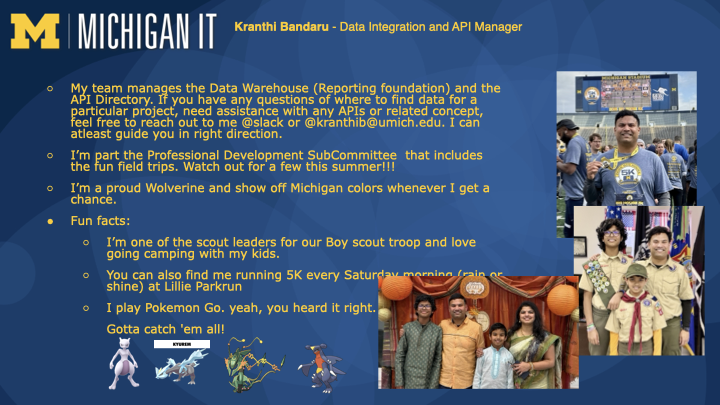

---

## Valerie Van Haaften
* **Title:** BSA Lead
* **Department:** Enterprise Application Systems (Human Capital Management)
* **Key Responsibilities:**
    * Supports the HR system (Payroll, Benefits, Time & Labor).
    * **Committee Role:** Member of the Mentorship Subcommittee.

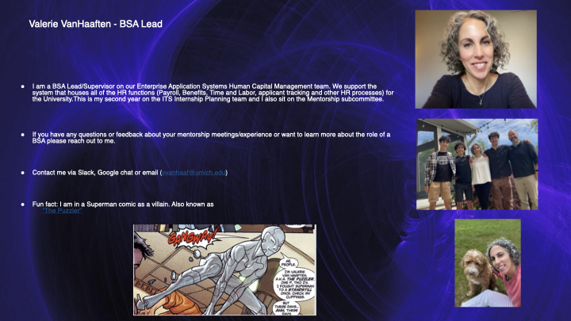

---

## Jared Walfish
* **Title:** Information Systems Manager
* **Department:** ITS
* **Key Responsibilities:**
    * Long-time Planning Team member (3 years).
    * Veteran host of many interns throughout the years.

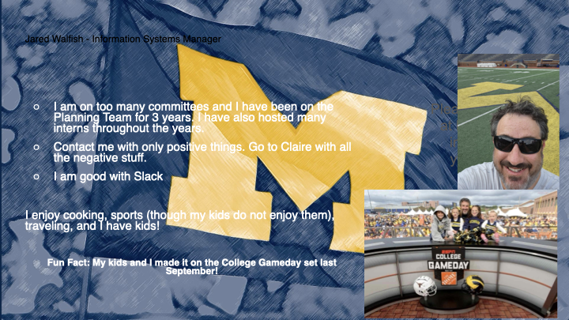

---

## Kara Thomas
* **Title:** Business Systems Analyst (BSA)
* **Department:** ITS Project Management Office
* **Key Responsibilities:**
    * **Committee Role:** Member of Mentorship, Professional Development, Cohort Projects, and Fellowship Subcommittees.
    * **Contact For:** Overall program questions and cohort projects.

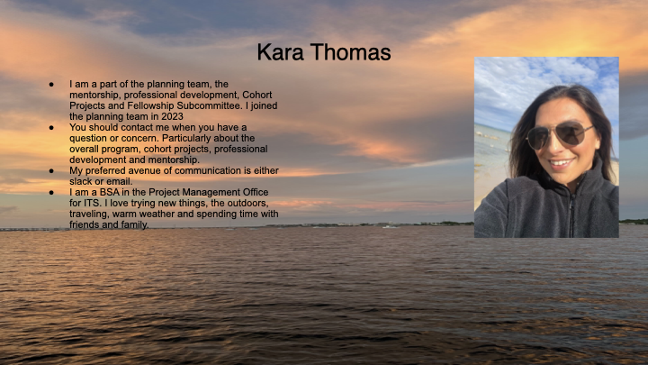

---

## Dave Chmura
* **Title:** Systems Architect Lead
* **Department:** LSA Technology Services
* **Key Responsibilities:**
    * Product lead, developer, and designer.
    * Leads the Ruby on Rails team within Web Application Development Services.

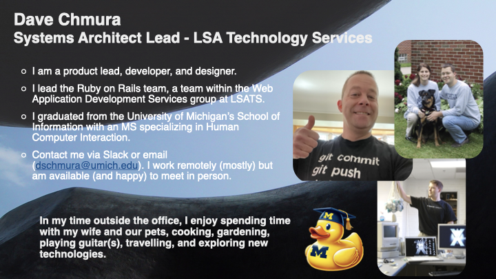

---

## Jaron Fox
* **Title:** Service Center Supervisor
* **Department:** LSA Technology Services
* **Key Responsibilities:**
    * Oversees tier-one IT support and customer experience.
    * **Committee Role:** Orientation committee.
    * **Support:** Assists with resumes, CVs, cover letters, and interview prep.

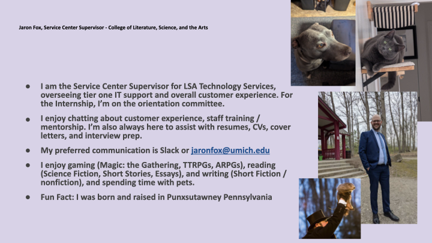

---

## Kristen Bolger
* **Title:** Depot IT Operations Manager
* **Department:** ITS
* **Key Responsibilities:**
    * Manages desktop support, asset management, and device logistics.
    * **Committee Role:** Member of the Mentorship Subcommittee (former program mentor).

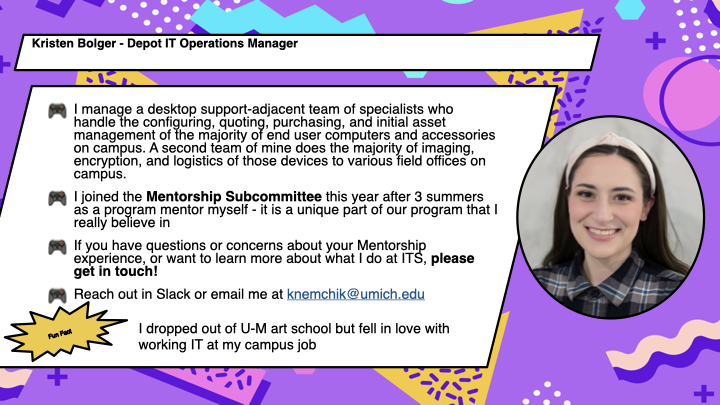

---

## Daniel Heyse
* **Title:** Administrative Support / Executive Assistant
* **Department:** ITS Enterprise Applications Services
* **Key Responsibilities:**
    * Provides support to Executive Director Cathy Handyside.
    * **Committee Role:** Recruitment, application reviews, interviews, and planning the **Intern Showcase**.

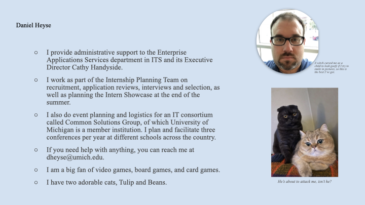

---

## Jane Zhao
* **Title:** WeMo AD Manager (Web and Mobile Application Development)
* **Department:** ITS
* **Key Responsibilities:**
    * Hires interns for web/mobile dev.
    * **Committee Role:** Program recruitment, Summer Academy organization, and application reviews.

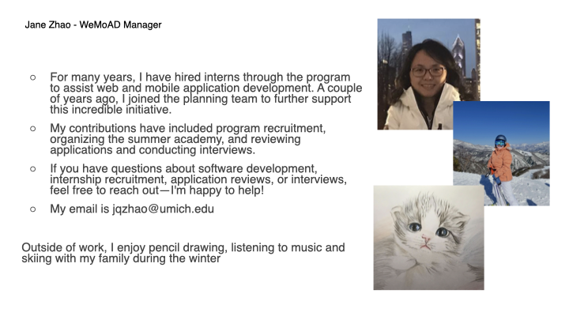

---

## Monica Hickson, M.A.
* **Title:** Instructional Learning Specialist
* **Department:** ITS Teaching and Learning
* **Key Responsibilities:**
    * Teaches workshops in Diversity, Equity, and Inclusion (DEI).
    * Teaches AI literacy.

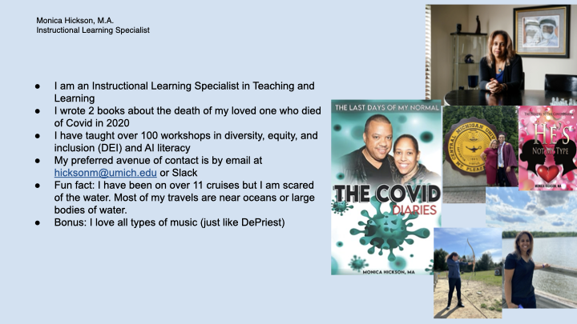

---

## Kim Wheeler
* **Title:** Administrative Specialist
* **Department:** ITS Privacy/Policy and Information Assurance
* **Key Responsibilities:**
    * Supports Privacy/Policy and IA teams.
    * Coordinates university-wide education & awareness events.
    * Liaison for ITS HR, facilities, and finance groups.

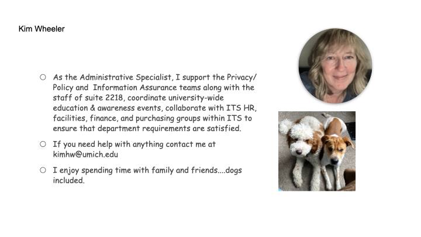

---

## Zhen Qian
* **Title:** App Dev Manager
* **Department:** ITS Teaching and Learning
* **Key Responsibilities:**
    * Supports Canvas LMS and T&L tools.
    * **Support:** Career advice, open-source application development, and learning analytics.

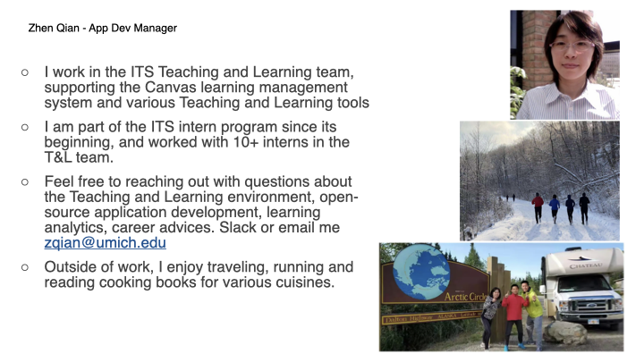

---

## Kieran Haas
* **Title:** Intern Liaison (Temporary Full-Time Employee)
* **Department:** ITS / IAM
* **Key Responsibilities:**
    * **Role:** Liaison between the planning team and interns.
    * Assists with the website and Wolverine Identity Project.
    * **Background:** Former Intern ('22) and Fellow ('23, '24).

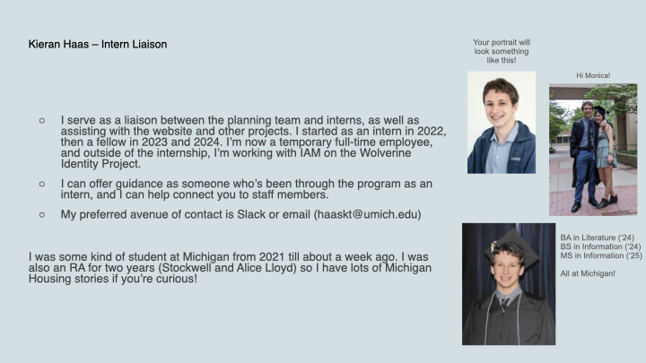

---

### Additional Planning Team Members (Not Pictured)
* **Kenny Moore**, ITS
* **Kyle Cozad**, ITS